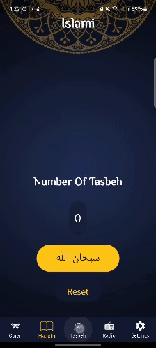
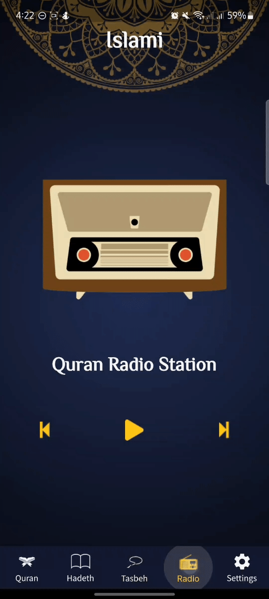
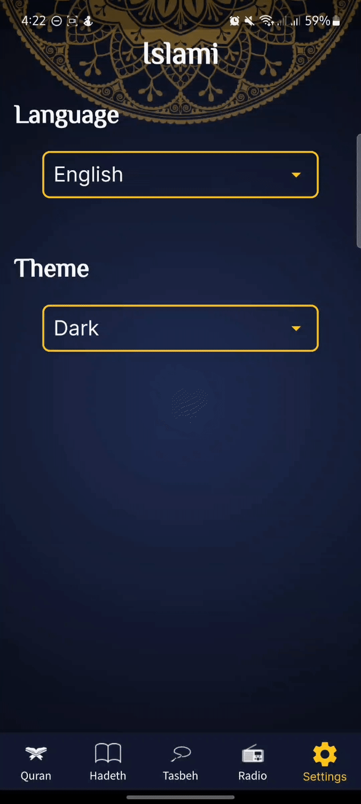

# Islami
*Islami is a special phone app for Muslims.
It helps you with your faith and makes it easy to learn about Islam. You can use it at home or anywhere you go, and it gives you lots of important Islamic stuff on your phone.*

&nbsp;

## Languages and Technologies

&nbsp;

## GETTING INTO THE PROJECT:
Islami application supports English and Arabic languages and Light and Dark modes.

**It contains 5 main pages:**

&nbsp; &nbsp; &nbsp; 1. Quran.

&nbsp; &nbsp; &nbsp; 2. Hadeth.

&nbsp; &nbsp; &nbsp; 3. Tasbeh.

&nbsp; &nbsp; &nbsp; 4. Radio.

&nbsp; &nbsp; &nbsp; 5. Settings.

&nbsp;

**Quran page:**

&nbsp; &nbsp; &nbsp; Here you can open and read all Quran Suras by clicking on the desired one.

&nbsp;

&nbsp;

&nbsp;

**Hadeth page:**

&nbsp; &nbsp; &nbsp; Here you find up to 50 Hadeth.

&nbsp;

&nbsp;

&nbsp;

**Tasbeh page:**

&nbsp; &nbsp; &nbsp; It has sebha which rotates clockwise with every tap.

&nbsp;

&nbsp;

&nbsp;

**Radio page:**

&nbsp; &nbsp; &nbsp; You can listen to Quran Radio Station from here.

&nbsp;

&nbsp;

&nbsp;

**Settings page:**

&nbsp; &nbsp; &nbsp; You can change application language and theme from here.

